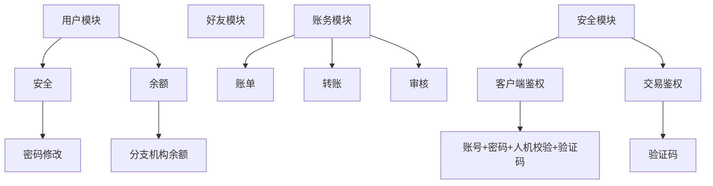
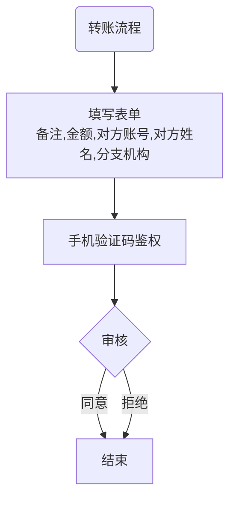
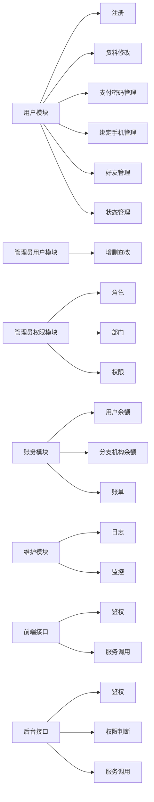
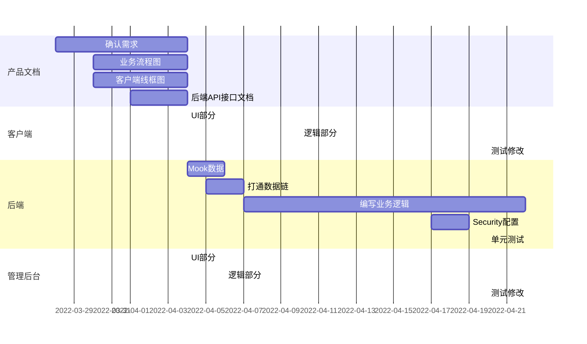

APP项目分析

需求：实现“雄伟”app目前所包含的功能
## 雄伟app分析
### 整体架构

### 主要业务流程

### 功能理解

此APP大致就是记账的功能，记录着某个用户在某个分支机构存有多少钱、某用户某时刻给其它用户转账多少钱、是否允许。

## 项目规划

### 技术栈选型

因此类应用数据价值高，故对安全要求高，应选用成熟的企业级技术栈

#### 持久层MySql

成熟的关系型数据库而且免费，后期如有更高要求可轻松改为Oracle

#### 后端Springboot+Mybatis+SpringSecurity

Java在企业级开发领域长期老大的地位，选择Springboot也几乎不需要理由，阿里腾讯等大厂都在用，生态优于任何框架，跟着用就对了。全面向对象、面向接口开发，后期如用户量大需大并发，或者功能不断增加，可用上Springcloud做微服务开发，易拓展

#### 后台React+Antd

现在做后台主流的框架就Vue和React。Antd是阿里的框架，阿里自己都在用。React在做大项目方面拓展性和可维护性均优于Vue，故选型React

#### 客户端前期Uniapp，后期原生混编

uniapp成熟稳定、开发周期短、交付快，适合前期使用。等开发到接近成熟阶段再改为原生+webview混编的方式，提升用户体验

### 初步构思

#### 客户端

在实现功能的前提，尽量参考甚至仿造生活中常用的支付App，如微信支付、支付宝、PayPal，包括界面风格、布局、和交互流程，原因如下：

1. 符合用户习惯，容易上手
2. 扁平化外观更显高大上
3. 业务流程成熟，少走弯路

#### 后端模块

管理员的权限模块是考虑到分支机构可能有后台需求，需要管理机构下属的用户和员工

#### 关于可拓展性

当前功能需求比较简单，若只是测试或小规模部署，用无类型脚本语言（如php,javascript）可能成本更低，速度更快。但如考虑后期要增加功能，是计划长远的正式项目，则从文档到架构都应按企业级应用的标准来操作，虽然前期开发工作量大，但可维护性高，后期增加功能可以最大限度的不改动现有代码。

#### 工程进度预估

总历时1个月时间，为人员充足工作安排正常的情况。如项目紧急，可省略前期的文档制作（后期补上）
